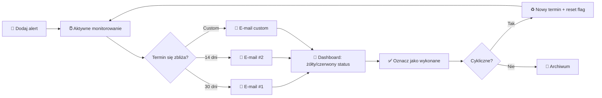

# 🔔 TaskAlert — System Przypomnień i Alertów Terminowych

**TaskAlert** to nowoczesna, progresywna aplikacja webowa (PWA) do zarządzania terminami i przypomnieniami w organizacji. System automatycznie monitoruje daty wygaśnięcia polis ubezpieczeniowych, przeglądów technicznych pojazdów, badań lekarskich pracowników, szkoleń BHP i dowolnych innych zdarzeń cyklicznych — wysyłając elastyczne powiadomienia e-mail z konfigurowalnym wyprzedzeniem czasowym.

Aplikacja została zaprojektowana z myślą o użytkownikach nie-technicznych: prosty i intuicyjny interfejs, kolorowe statusy (🟢🟡🔴), wizualne odliczanie do terminów i inteligentne domyślne ustawienia.

---

## 🛠️ Stos Technologiczny

- **Frontend**: Czysty HTML5, CSS3 (Light/Dark mode z CSS Custom Properties) oraz JavaScript (ES Modules, SPA Router z lazy-loadingiem).
- **Backend (Baza danych & Auth)**: Google Firebase v10.12.0 (Firestore + Authentication via Email/Password oraz Google Sign-In).
- **PWA (Offline Support)**: Service Worker z wersjonowanym systemem pamięci podręcznej (Cache Storage) — `taskalert-v8`.
- **E-mail Notifications**: Firebase Extension "Trigger Email from Firestore" + GitHub Actions (cron co 24h).
- **Brak procesu budowania**: Projekt uruchamia się bezpośrednio z plików źródłowych (Firebase z CDN).

---

## 📁 Struktura Projektu

```
06_TaskAlert/
├── index.html                 # App Shell + ekrany logowania/rejestracji
├── manifest.json              # Manifest PWA (instalacja na telefonie/pulpicie)
├── service-worker.js          # Mechanizm pamięci podręcznej i pracy offline (cache v8)
├── firestore.rules            # Reguły zabezpieczeń Firestore
├── plan_wdrozenia_taskalert_v3.pdf  # Oryginalny plan wdrożenia
├── icons/
│   ├── icon-192.png           # Ikona PWA 192x192
│   └── icon-512.png           # Ikona PWA 512x512
├── scripts/
│   ├── daily_check.js         # Dobowy skrypt sprawdzania alertów (GitHub Actions)
│   ├── konfiguracja_email.md  # Przewodnik krok-po-kroku konfiguracji serwera home.pl i wysyłki e-mail
│   └── uwagi.md               # Rejestr zgłoszeń i uwag użytkownika
├── css/
│   └── style.css              # Kompletny Design System (Light + Dark Mode)
└── js/
    ├── firebase-config.js     # Konfiguracja połączenia z Firebase
    ├── auth.js                # Autoryzacja Email/Password (rejestracja, login, reset)
    ├── app.js                 # Router SPA, toasty, modale, helpery, FAB
    ├── db.js                  # Warstwa dostępu do danych (Firestore CRUD — bezindeksowe filtrowanie/sortowanie, obsługa błędów real-time)
    └── modules/               # Niezależne moduły SPA (ładowane dynamicznie)
        ├── dashboard.js       # Pulpit z widgetami, timeline, chart SVG
        ├── samochody.js       # Alerty: polisy OC/AC, przeglądy techniczne
        ├── kadry.js           # Alerty: badania lekarskie, szkolenia BHP
        ├── inne.js            # Alerty: elastyczny koszyk pozostałych terminów
        ├── kategorie.js       # Zarządzanie kategoriami (CRUD globalny)
        ├── historia.js        # Archiwum wykonanych alertów + eksport CSV
        └── ustawienia.js      # Ustawienia konta, e-maile, motyw, eksport JSON
```

---

## 🔄 Przepływ Alertów — Cykl Życia Przypomnienia



---

## 📑 Opis Modułów Aplikacji

### 1. Pulpit (Dashboard)
- **4 karty statystyk** z animowanymi licznikami: aktywne alerty, w ciągu 30 dni, w ciągu 14 dni, przeterminowane.
- **Timeline najbliższych terminów** z kolorowymi statusami (🟢 >30d, 🟡 14-30d, 🔴 <14d, pulsujący 🔴 = przeterminowane) i paskami postępu.
- **Wykres kołowy SVG** — rozkład alertów po kategoriach.
- **Badge w nawigacji** z liczbą pilnych alertów.

### 2. Samochody
- Zarządzanie polisami ubezpieczeniowymi (OC/AC) i przeglądami technicznymi.
- Wyszukiwanie, filtrowanie po statusie i typie, sortowanie po dacie.
- Dialog wykonania z auto-kalkulacją następnego terminu.
- Możliwość ręcznego wysłania powiadomienia e-mail.

### 3. Kadry
- Monitorowanie badań lekarskich i szkoleń BHP pracowników.
- Identyczna funkcjonalność jak moduł Samochody, z podtypami kadrowymi.

### 4. Inne
- Elastyczny koszyk na pozostałe przypomnienia (certyfikaty, licencje, itp.).
- Agreguje alerty ze wszystkich kategorii poza Samochody i Kadry.

### 5. Kategorie
- Tworzenie nowych kategorii (globalnie widoczne dla wszystkich użytkowników).
- Edycja nazwy, ikony (emoji), koloru i podtypów.
- Przełącznik widoczności per użytkownik.
- Kategorie domyślne (Samochody, Kadry, Inne) chronione przed usunięciem.

### 6. Historia
- Archiwum wykonanych/zamkniętych alertów z logiem zmian.
- Wyszukiwanie i eksport do CSV (UTF-8 z BOM).

### 7. Ustawienia
- Profil użytkownika (nazwa, domyślne e-maile).
- Konfiguracja domyślnych dni alertów (np. [30, 14] + możliwość dodania dowolnych).
- Przełącznik motywu (jasny / ciemny).
- Eksport wszystkich danych do JSON.

---

## 🗄️ Model Danych (Struktura Firestore)

### Kolekcja globalna: `categories`
```json
{
  "name": "Samochody",
  "icon": "🚗",
  "color": "#4f8cff",
  "isDefault": true,
  "order": 1,
  "subTypes": [
    { "key": "polisa_oc", "label": "Polisa OC" },
    { "key": "polisa_ac", "label": "Polisa AC" },
    { "key": "przeglad", "label": "Przegląd techniczny" },
    { "key": "custom", "label": "Inne" }
  ],
  "createdAt": "Timestamp",
  "updatedAt": "Timestamp"
}
```

### Kolekcja: `/users/{uid}/profile/main`
```json
{
  "displayName": "Jan Kowalski",
  "email": "jan@example.com",
  "defaultPrimaryEmail": "jan@example.com",
  "defaultSecondaryEmail": "",
  "defaultAlertDays": [30, 14],
  "createdAt": "Timestamp",
  "lastLoginAt": "Timestamp"
}
```

### Kolekcja: `/users/{uid}/reminders/{reminderId}`
```json
{
  "title": "OC - Opel Astra GJ 12345",
  "description": "Polisa PZU nr 123456789",
  "categoryId": "ID_KATEGORII",
  "categoryName": "Samochody",
  "subType": "polisa_oc",
  "subTypeLabel": "Polisa OC",
  "primaryEmail": "jan@example.com",
  "secondaryEmail": "sekretariat@firma.pl",
  "expiryDate": "Timestamp",
  "status": "active",
  "alertDays": [30, 14],
  "alertFlags": { "30": false, "14": false },
  "lastExecutedAt": null,
  "recurrenceMonths": 12,
  "notes": "Agent: Anna Nowak, tel. 600 700 800",
  "history": [
    { "type": "created",    "timestamp": "Timestamp", "note": "Utworzenie alertu w systemie", "expiryDate": "Timestamp" },
    { "type": "edited",     "timestamp": "Timestamp", "note": "Zaktualizowano dane przypomnienia" },
    { "type": "email_sent", "timestamp": "Timestamp", "recipients": ["jan@example.com"], "note": "Wysłano powiadomienie e-mail (jan@example.com)" },
    { "type": "executed",   "timestamp": "Timestamp", "executedAt": "Timestamp", "newExpiry": "Timestamp|null", "note": "Oznaczono przypomnienie jako wykonane" }
  ],
  "createdAt": "Timestamp",
  "updatedAt": "Timestamp"
}
```

### Kolekcja: `/users/{uid}/settings/categoryVisibility`
```json
{
  "CATEGORY_ID_1": true,
  "CATEGORY_ID_2": false
}
```

---

## 🔒 Bezpieczeństwo i Uprawnienia

Dostęp do bazy danych regulują reguły **Cloud Firestore Security Rules** (`firestore.rules`):
- Dane użytkownika (`/users/{uid}/**`) — pełny dostęp tylko dla właściciela UID.
- Kategorie (`/categories/**`) — odczyt i zapis dla każdego zalogowanego użytkownika (globalne).
- Kolekcja mail (`/mail/**`) — tylko zapis (trigger dla Firebase Extension).

*Uwaga dotycząca zapytań*: Pobieranie przypomnień realizowane jest przez subkolekcje użytkownika, a filtrowanie po statusie oraz sortowanie chronologiczne wykonywane jest bezpiecznie po stronie klienta (JavaScript) z pełną obsługą błędów `onSnapshot`. Dzięki temu baza danych nie wymaga zdefiniowanych złożonych indeksów (composite indexes) w konsoli Firebase, co gwarantuje natychmiastowe ładowanie danych i zapobiega zapętlaniu się spinnera ładowania.

**Autoryzacja**: Email/Password (Firebase Authentication) — kompatybilna z urządzeniami Apple.

---

## 💻 Uruchomienie Lokalne

Projekt wymaga lokalnego serwera HTTP:

### Sposób A (Python — zalecane)
```powershell
cd c:\03_Antigravity\06_TaskAlert
python -m http.server 3001
```
Aplikacja: **http://localhost:3001**

### Sposób B (Node.js/npm)
```powershell
cd c:\03_Antigravity\06_TaskAlert
npx serve -l 3001
```

---

## 🔥 Konfiguracja Firebase

### 1. Utwórz nowy projekt Firebase
1. Otwórz [Firebase Console](https://console.firebase.google.com).
2. Kliknij **Add project** → nazwa: `taskalert-app`.
3. Przejdź do **Project Settings** → **Your apps** → **Add app** (Web).
4. Skopiuj konfigurację (`apiKey`, `authDomain`, itp.) do pliku `js/firebase-config.js`.

### 2. Włącz Authentication
1. Firebase Console → **Authentication** → **Sign-in method**.
2. Włącz **Email/Password**.
3. W zakładce **Settings** → **Authorized domains** dodaj:
   - `localhost`
   - `tomaszdrozdaeit.github.io`

### 3. Utwórz bazę Firestore
1. Firebase Console → **Firestore Database** → **Create database**.
2. Wybierz region (np. `europe-west1`).
3. Wgraj reguły z pliku `firestore.rules`.

### 4. (Opcjonalnie) Firebase Extension — Trigger Email
1. Firebase Console → **Extensions** → zainstaluj **Trigger Email from Firestore**.
2. Skonfiguruj SMTP (np. SendGrid, Mailgun).
3. Ustaw kolekcję monitorowaną na `mail`.

---

## 🌐 Hosting na GitHub Pages

Aplikacja jest hostowana pod adresem: `tomaszdrozdaeit.github.io/project-taskalert`

### Procedura Aktualizacji (Deployment)
```powershell
git add .
git commit -m "Opis zmian"
git push origin main
```
GitHub Pages automatycznie zaktualizuje aplikację w ciągu 1-2 minut.

---

## 🔄 Aktualizacja PWA w przeglądarkach

1. Otwórz plik `service-worker.js`.
2. Zwiększ wersję w `CACHE_NAME` (np. `taskalert-v1` → `taskalert-v2`).
3. Zaktualizuj listę `ASSETS_TO_CACHE` jeśli doszły nowe pliki.
4. Zrób commit i push.
5. Użytkownicy: Ctrl+Shift+R (hard refresh) jeśli zmiany nie widoczne od razu.

---

## 📧 System Powiadomień E-mail

### Automatyczne (Opcja A)
- **GitHub Actions cron** uruchamiany codziennie o 7:00 sprawdza daty wygaśnięcia.
- Wstawia dokumenty do kolekcji `mail/` w Firestore.
- **Firebase Extension** "Trigger Email" wysyła e-maile przez SMTP.

### Ręczne
- Przycisk ✉️ przy każdym przypomnieniu umożliwia natychmiastowe wysłanie powiadomienia do osób przypisanych.
