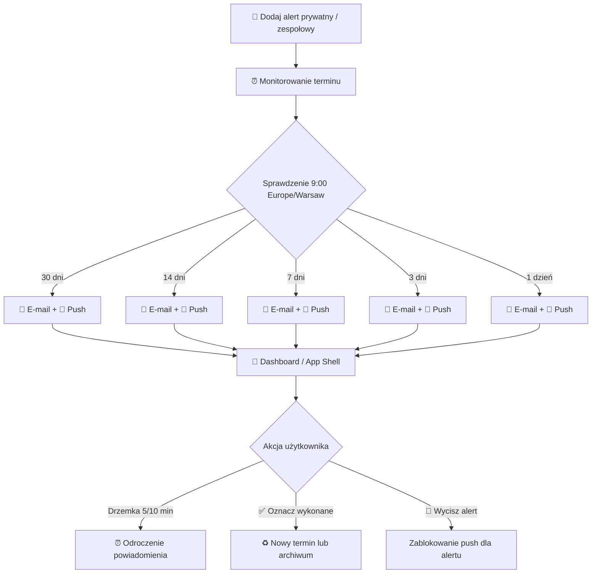

# 🔔 TaskAlert — System Przypomnień i Alertów Terminowych (v4)

**TaskAlert** to nowoczesna, progresywna aplikacja webowa (PWA) do zarządzania terminami, przypomnieniami i alertami zespołowymi w organizacji. System automatycznie monitoruje daty wygaśnięcia polis ubezpieczeniowych, przeglądów technicznych pojazdów, badań lekarskich pracowników, szkoleń BHP oraz dowolnych innych zdarzeń cyklicznych — wysyłając powiadomienia e-mail oraz natywne powiadomienia **PUSH** na urządzenia mobilne i komputery.

Aplikacja została zaprojektowana z myślą o maksymalnej użyteczności: intuicyjny interfejs, kolorowe statusy (🟢🟡🔴), wizualne odliczanie, ulepszony baner instalacji PWA, zaawansowane wyszukiwanie z list rozwijanych z bazy oraz kontrola dostępu oparta na liście autoryzowanych adresów e-mail (whitelist).

---

## 🛠️ Stos Technologiczny

- **Frontend**: Czysty HTML5, CSS3 (Light/Dark mode z CSS Custom Properties i glassmorphism) oraz JavaScript (ES Modules, SPA Router z lazy-loadingiem).
- **Backend (Baza danych & Auth)**: Google Firebase v10.12.0 (Firestore + Authentication via Email/Password oraz Google Sign-In z automatyczną weryfikacją whitelisty `allowedUsers`).
- **PWA (Offline & Mobile Support)**: Service Worker z wersjonowanym systemem pamięci podręcznej — `taskalert-v38`, wykrywaniem platformy (Android/iOS/macOS), dedykowanym banerem instalacyjnym oraz pełnym wsparciem safe-area i przewijania menu na urządzeniach mobilnych.
- **Powiadomienia PUSH**: Firebase Cloud Messaging (FCM) + Cloud Functions / GitHub Actions (Cron o 9:00 czasu polskiego `Europe/Warsaw` z obsługą czasu letniego/zimowego DST, deduplikacją po `tag: alertId`, czyszczeniem nieaktywnych tokenów FCM, akcjami drzemki 5/10 min). Dedykowana bezpieczna obsługa Androida (`ServiceWorkerRegistration.showNotification()`), monochromatyczna ikona paska stanu Android (`badge-72.png` z przezroczystością) oraz automatyczne przekierowanie po kliknięciu powiadomienia bezpośrednio do okna szczegółów danego alertu (`?alertId=...`).
- **Interaktywny Pulpit & Ostatnie Działania**: Dynamiczne kafelki statystyk (Aktywne, W ciągu 30 dni, W ciągu 14 dni, Przeterminowane, Wykonane) filtrujące oś czasu po kliknięciu, wykres rozkładu kategorii oraz widget ostatnich wykonanych działań z ostatnich 7 dni.
- **Alerty Jednorazowe & Cykliczne**: Opcja tworzenia alertów jednorazowych z dedykowanym checkboxem (automatycznie ustawiającym interwał na 0 mies.), które po oznaczeniu jako wykonane przechodzą do archiwum/historii bez niepotrzebnego odnawiania.
- **Prywatna Lista E-maili & Synchronizacja w Chmurze**: Każdy użytkownik może dodawać i zarządzać własnymi prywatnymi adresami e-mail do powiadomień (`users/{uid}/profile/main.customEmails`), które są synchronizowane w chmurze Firestore na wszystkich urządzeniach oraz dostępne na listach wyboru we wszystkich alertach.
- **Panel Użytkownicy & Alerty Zespołowe**: Dostępny i w pełni responsywny panel zarządzania użytkownikami na mobile/Android oraz możliwość przypisywania zadań zespołowych także do kont nieaktywnych.
- **Panel Historia & Audyt Zdarzeń**: Interaktywny panel zarchiwizowanych alertów z możliwością otwarcia okna szczegółów każdego wykonanego zadania, pełną osią czasu zdarzeń (kto i kiedy utworzył, edytował, wysłał e-mail, przekształcił w zespołowy lub oznaczył jako wykonane) oraz eksportem do pliku CSV.
- **E-mail Notifications**: Firebase Extension "Trigger Email from Firestore" + GitHub Actions / Node.js dobowe weryfikacje.
- **Testy**: Automatyczne testy reguł bezpieczeństwa Firestore (`tests/firestore-rules.test.js`) + audyt bezpieczeństwa.

---

## 📁 Struktura Projektu

```
06_TaskAlert/
├── index.html                 # App Shell + ekrany logowania/rejestracji + nawigacja
├── manifest.json              # Manifest PWA (gcm_sender_id dla FCM + instalacja)
├── service-worker.js          # Pamięć podręczna (cache v38) + obsługa PUSH w tle i akcji drzemki
├── firestore.rules            # Reguły zabezpieczeń Firestore (strict owner, allowedUsers, sharedAlerts)
├── RESTART_HANDOVER.md        # Przewodnik restartowy dla agenta po restarcie komputera
├── plan_wdrozenia_taskalert_v3.pdf  # Dokumentacja wdrożeniowa
├── icons/
│   ├── icon-192.png           # Ikona PWA 192x192
│   ├── icon-512.png           # Ikona PWA 512x512
│   └── badge-72.png           # Monochromatyczna ikona checkmark (status bar Android)
├── functions/                 # Firebase Cloud Functions (v2)
│   ├── package.json           # Zależności (firebase-admin, firebase-functions)
│   └── index.js               # Scheduled Push Cron (9:00 Europe/Warsaw) + testowe push
├── tests/                     # Testy automatyczne i audyt bezpieczeństwa
│   ├── firestore-rules.test.js# Testy automatyczne reguł Firestore
│   └── security-audit.md      # Raport audytu bezpieczeństwa systemu
├── scripts/
│   ├── daily_check.js         # Dobowy skrypt sprawdzania alertów e-mail (GitHub Actions)
│   ├── generate_badge.py      # Generator przezroczystych ikon badge checkmark
│   ├── konfiguracja_email.md  # Przewodnik konfiguracji SMTP
│   ├── uwagi.md               # Rejestr zgłoszeń (wersja v1)
│   └── uwagi_v2.md            # Rejestr zgłoszeń (wersja v2)
├── css/
│   └── style.css              # Kompletny Design System (PWA banner, tab-bar, chipy, responsive)
└── js/
    ├── firebase-config.js     # Konfiguracja połączenia z Firebase
    ├── auth.js                # Autoryzacja + weryfikacja whitelisty (allowedUsers, super-admin)
    ├── app.js                 # Router SPA, toasty, modale, routing notificationclick, dropdowny e-mail
    ├── db.js                  # Firestore CRUD (reminders, categories, allowedUsers, sharedAlerts)
    ├── mail-utils.mjs         # Generator szablonów wiadomości e-mail (rozbudowane sekcje notatek)
    └── modules/               # Niezależne moduły SPA (ładowane dynamicznie)
        ├── dashboard.js       # Pulpit z widgetami, timeline, SVG Donut Chart
        ├── samochody.js       # Alerty pojazdów (polisy OC/AC, przeglądy)
        ├── kadry.js           # Alerty kadrowe (badania lekarskie, szkolenia BHP)
        ├── inne.js            # Koszyk pozostałych terminów
        ├── kategorie.js       # Zarządzanie kategoriami
        ├── historia.js        # Archiwum wykonanych alertów + eksport CSV
        ├── ustawienia.js      # Ustawienia profilu, e-maile, PUSH (włącz/wyłącz/test), motyw, eksport JSON
        ├── admin-users.js     # Panel zarządzania użytkownikami (whitelist, role, blokada)
        ├── team-alerts.js     # Alerty zespołowe/współdzielone (role: owner, executor, observer)
        ├── push-notifications.js # Moduł kliencki FCM (uprawnienia, tokeny, drzemki, wyciszanie)
        └── pwa-install-banner.js # Detekcja Android/iOS + baner instalacji PWA
```

---

## 🔄 Przepływ Alertów — Cykl Życia Przypomnienia


```mermaid
graph TD
    A[📝 Dodaj alert prywatny / zespołowy] --> B[⏰ Monitorowanie terminu]
    B --> C{Sprawdzenie 9:00 Europe/Warsaw}
    C -->|30 dni| D[📧 E-mail + 📲 Push]
    C -->|14 dni| E[📧 E-mail + 📲 Push]
    C -->|7 dni| F[📧 E-mail + 📲 Push]
    C -->|3 dni| G[📧 E-mail + 📲 Push]
    C -->|1 dzień| H[📧 E-mail + 📲 Push]
    D & E & F & G & H --> I[🔔 Dashboard / App Shell]
    I --> J{Akcja użytkownika}
    J -->|Drzemka 5/10 min| K[⏰ Odroczenie powiadomienia]
    J -->|✅ Oznacz wykonane| L[♻️ Nowy termin lub archiwum]
    J -->|🔕 Wycisz alert| M[Zablokowanie push dla alertu]
```

---

## 📑 Opis Modułów Aplikacji

### 1. Pulpit (Dashboard)
- 4 karty statystyk z animowanymi licznikami: aktywne alerty, w ciągu 30 dni, w ciągu 14 dni, przeterminowane.
- Timeline najbliższych terminów z statusami (🟢 >30d, 🟡 14-30d, 🔴 <14d, pulsujący 🔴 = przeterminowane) i paski postępu.
- Wykres kołowy SVG z rozkładem po kategoriach.

### 2. Samochody, Kadry & Inne
- Dedykowane moduły dziedzinowe z filtrowaniem, wyszukiwaniem i automatycznym wyliczaniem kolejnych terminów.
- Formularze zawierają adresy e-mail pobierane z bazy (`allowedUsers`) w formie wygodnych list rozwijanych.

### 3. Alerty Zespołowe (`team-alerts.js`)
- Współdzielenie zadań i terminów między wieloma użytkownikami.
- Zakładki filtrowania: "Moje zlecone" (Właściciel), "Zlecone mi" (Wykonawca), "Obserwowane" (Obserwator).
- Przypisywanie osób z bazy z przydzielaniem konkretnych ról.
- Bezpośrednia konwersja istniejących alertów prywatnych na alerty zespołowe bez utraty szczegółów ani historii zdarzeń.

### 4. Użytkownicy (`admin-users.js`)
- Panel zarządzania dostępem do aplikacji (dla administratorów).
- Dodawanie nowych adresów e-mail, zmiana ról (`admin`, `user`), blokowanie/odblokowywanie kont.
- Wbudowana ochrona super-administratora (`tomasz.drozda.eit@gmail.com`) przed usunięciem.

### 5. Ustawienia & PWA / Push
- Sekcja zarządzania powiadomieniami PUSH: sprawdzanie uprawnień, włączanie/wyłączanie, przycisk testowego wysłania powiadomienia.
- Dedykowane wskazówki instalacyjne dla użytkowników iOS oraz komputerów Mac.
- Domyślne progi alertów (`30, 14, 7, 3, 1` dni).
- Inteligentny baner instalacji PWA z instrukcją dla Safari i przyciskiem automatycznej instalacji w Chromium.

---

## 📱 Instrukcja Instalacji PWA & Powiadomień PUSH (iOS, Mac, Android, Windows)

TaskAlert jest progresywną aplikacją webową (**Progressive Web App - PWA**). Możesz ją zainstalować na dowolnym smartfonie, tablecie lub komputerze bezpośrednio z przeglądarki internetowej — bez potrzeby korzystania ze sklepów App Store czy Google Play.

---

### 🍏 1. iPhone oraz iPad (System iOS / iPadOS 16.4+)

> [!IMPORTANT]
> **Warunek konieczny dla powiadomień PUSH na iOS:**
> Firma Apple wprowadziła obsługę Web Push w systemie iOS od wersji **16.4**. Powiadomienia PUSH działają na urządzeniach iPhone i iPad **wyłącznie po dodaniu aplikacji do Ekranu Głównego** i uruchomieniu jej ze skrótu (tryb PWA / Standalone). Standardowa przeglądarka Safari w trybie kart nie pozwala na odbiór alertów w tle.

#### Krok po kroku:
1. **Otwórz aplikację w Safari:** Uruchom przeglądarkę **Safari** na swoim iPhone / iPadzie i wejdź pod adres TaskAlert (`https://tomaszdrozdaeit.github.io/project-taskalert`).
2. **Kliknij przycisk Udostępnij:** Na dolnym pasku narzędzi Safari kliknij ikonę **Udostępnij** (kwadrat ze strzałką skierowaną w górę: ⎋ / Share).
3. **Wybierz „Do ekranu początkowego”:** Przewiń listę opcji w dół i stuknij pozycję **„Do ekranu początkowego”** (lub *„Dodaj do ekranu głównego”* / *Add to Home Screen*).
4. **Zatwierdź:** Kliknij **„Dodaj”** w prawym górnym rogu ekranu. Na Twoim pulpicie pojawi się ikona TaskAlert.
5. **Uruchom i włącz powiadomienia:** 
   - Zamknij Safari i **otwórz TaskAlert bezpośrednio z ikony na Ekranie Głównym**.
   - Zaloguj się na swoje konto.
   - Przejdź do zakładki **⚙️ Ustawienia → Powiadomienia PUSH**.
   - Kliknij **„🔔 Włącz powiadomienia”** i wybierz **„Pozwól”** w systemowym komunikacie iOS.

---

### 💻 2. Komputery Mac (macOS)

Na komputerach z systemem macOS aplikację można zainstalować zarówno przez przeglądarkę **Safari**, jak i **Google Chrome** czy **Microsoft Edge**.

#### Opcja A: Przeglądarka Safari (macOS Sonoma 14+)
1. Otwórz stronę TaskAlert w Safari.
2. W górnym pasku menu macOS kliknij **Plik** (File).
3. Wybierz opcję **„Dodaj do Docka...”** (Add to Dock...).
4. W wyświetlonym oknie potwierdź nazwę i kliknij **„Dodaj”**.
5. Ikona TaskAlert pojawi się w Docku macOS.
6. Uruchom aplikację z Docka i w **Ustawieniach** włącz powiadomienia PUSH.

#### Opcja B: Przeglądarka Google Chrome / Microsoft Edge na Macu
1. Otwórz stronę TaskAlert w Chrome lub Edge.
2. Po prawej stronie paska adresu URL kliknij ikonę instalacji **„Zainstaluj TaskAlert”** (lub z menu `⋮` → *Zapisz i udostępnij* → *Zainstaluj aplikację*).
3. Kliknij **„Zainstaluj”**. Aplikacja otworzy się w osobnym, dedykowanym oknie pozbawionym pasków przeglądarki.
4. Przejdź do **⚙️ Ustawienia** i kliknij **„🔔 Włącz powiadomienia”**.

---

### 🤖 3. Urządzenia z systemem Android

1. Otwórz stronę TaskAlert w przeglądarce **Google Chrome** na telefonie lub tablecie z Androidem.
2. Na dole ekranu automatycznie pojawi się baner **„Zainstaluj TaskAlert”** — kliknij przycisk **„Zainstaluj aplikację”**.
3. *(Alternatywnie)* Otwórz menu przeglądarki (trzy kropki `⋮` w prawym górnym rogu) i wybierz **„Zainstaluj aplikację”** lub **„Dodaj do ekranu głównego”**.
4. Po zainstalowaniu uruchom aplikację ze skrótu na pulpicie i w zakładce **⚙️ Ustawienia** włącz powiadomienia PUSH.

---

### 🖥️ 4. Komputery z systemem Windows (Chrome / Edge)

1. Otwórz TaskAlert w przeglądarce **Google Chrome** lub **Microsoft Edge**.
2. W pasku adresu URL kliknij ikonę **Zainstaluj aplikację** (lub w Edge: ikonę trzech kwadratów z plusem).
3. Kliknij **Zainstaluj**. Aplikacja doda skrót do menu Start i pulpitu Windows.
4. Włącz powiadomienia PUSH w zakładce **⚙️ Ustawienia**.

---

## 🗄️ Model Danych (Struktura Firestore)

### Kolekcja: `/allowedUsers/{email}` (Whitelist)
```json
{
  "uid": "firebase_auth_uid",
  "email": "jan@firma.pl",
  "name": "Jan Kowalski",
  "role": "admin",
  "isActive": true,
  "createdAt": "Timestamp",
  "lastLoginAt": "Timestamp"
}
```
> Pole `uid` jest automatycznie synchronizowane przy każdym logowaniu użytkownika (`ensureUserProfile`). Służy do poprawnego mapowania uczestników alertów zespołowych.

### Kolekcja: `/sharedAlerts/{alertId}` (Alerty Zespołowe)
```json
{
  "title": "Przegląd wózka widłowego",
  "description": "Przegląd UDT wózek 01",
  "categoryId": "samochody",
  "categoryName": "Samochody",
  "expiryDate": "Timestamp",
  "status": "active",
  "alertDays": [30, 14, 7, 3, 1],
  "recurrenceMonths": 12,
  "notes": "Firma serwisowa: ABC",
  "createdBy": "uid_admina",
  "createdByName": "Tomasz Drozda",
  "participants": [
    { "uid": "uid_jana", "email": "jan@firma.pl", "name": "Jan Kowalski", "role": "executor" },
    { "uid": "uid_admina", "email": "tomasz.drozda.eit@gmail.com", "name": "Tomasz Drozda", "role": "owner" }
  ],
  "participantUids": ["uid_jana", "uid_admina"],
  "history": [...]
}
```

### Kolekcja: `/users/{uid}/settings/pushConfig`
```json
{
  "pushEnabled": true,
  "fcmTokens": ["token_fcm_1", "token_fcm_2"],
  "mutedAlerts": ["alert_id_1"]
}
```

---

## 🔒 Bezpieczeństwo i Uprawnienia

Aplikacja stosuje rygorystyczne reguły bezpieczeństwa Firestore (`firestore.rules`):
- **`/users/{userId}/**`**: Dostęp wyłącznie dla właściciela UID.
- **`/allowedUsers/{email}`**: Odczyt dla zalogowanych, zapis wyłącznie dla ról `admin` oraz `super-admin`. Usuwanie konta super-admina jest uniemożliwione.
- **`/sharedAlerts/{alertId}`**: Dostęp przyznawany na podstawie obecności w tablicy uczestników. Filtrowanie po stronie klienta odbywa się zarówno po `participantUids` (Firebase UID), jak i po adresach e-mail uczestników — zapewniając kompatybilność wsteczną z danymi sprzed wersji 4.1.

### Testy Automatyczne
Uruchomienie pakietu testów reguł bezpieczeństwa:
```powershell
cd tests
npm test
```

---

## ☁️ Wdrożenie Cloud Functions (PUSH Scheduler)

Powiadomienia push są automatycznie harmonogramowane przez Firebase Cloud Functions v2:
1. Zapewnij plan Blaze w Firebase.
2. Wdrożenie funkcji z katalogu `functions/`:
```powershell
cd functions
firebase deploy --only functions
```
Funkcja `scheduledAlertCheck` wykonuje się codziennie o **9:00 czasu polskiego** (`Europe/Warsaw`), automatycznie obsługując zmiany na czas letni/zimowy.

---

## 🧪 Lokalne Testowanie (Środowisko Deweloperskie)

### Uruchomienie Serwera Lokalnego

```powershell
cd c:\03_Antigravity\06_TaskAlert
git checkout v4-dev
python server.py
```

Serwer nasłuchuje na **http://localhost:3001** (używaj `localhost`, nie `127.0.0.1`).

> **Ważne:** Google Sign-In działa wyłącznie na domenie `localhost`. Adres `127.0.0.1` nie jest domyślnie autoryzowany w Firebase — jeśli chcesz go użyć, dodaj go ręcznie w Firebase Console → Authentication → Authorized domains.

### Service Worker na Localhost

Na `localhost` Service Worker jest **automatycznie wyrejestrowany** przy starcie aplikacji i cache jest czyszczony — co gwarantuje zawsze świeży kod podczas developmentu. Nie jest potrzebne ręczne czyszczenie.

### Testowanie po zmianach

Odśwież stronę w przeglądarce (`F5`). Jeśli zmiany nie są widoczne, użyj `Ctrl+Shift+R` (wymuszone odświeżenie bez cache).

---

## 🌐 Hosting i Aktualizacja (GitHub Pages)

Adres produkcyjny: `tomaszdrozdaeit.github.io/project-taskalert`

### Aktualizacja
```powershell
git add .
git commit -m "Wdrożenie wersji v4 — PUSH, PWA banner, Whitelist, SharedAlerts"
git push origin main
```
Service worker korzysta z pamięci podręcznej **`taskalert-v38`**, zapewniając natychmiastową aktualizację zasobów u użytkowników.
